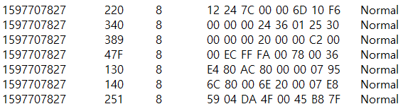
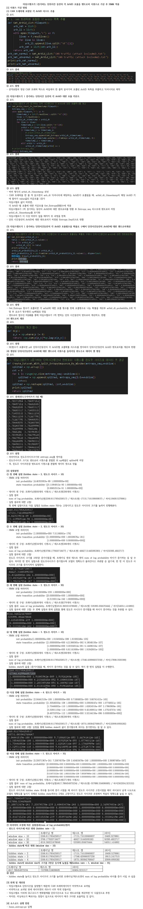
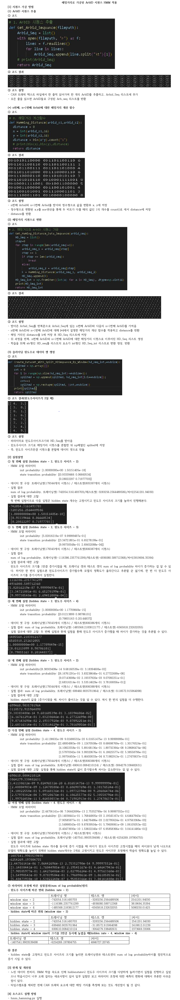

# HMMCANTrafficAnalysis
<div align="center">
    
</div>

<br>

<details>
<summary><b> 📌 프로젝트 개요</b></summary>
<br>

- CAN 네트워크에서 정상과 비정상(공격포함)트래픽을 가지고 데이터 가공후 HMM 알고리즘 적용
- 타임스탬프가 1씩 증가하는 단위시간 동안의 각 Arbid 호출을 엔트로피 시퀀스로 가공 및 HMM 적용
- 해밍 거리로 가공후 ArbId 시퀀스 HMM 적용

</details>

<br>

<details>
<summary><b> 🏃 프로젝트 실행</b></summary>
<br>

```bash
# prerequisites: python
# execution
git clone https://github.com/MpqM/ML_HMMCANTrafficAnalysis
python hmm_hamming_Arbid.py
python hmm_antropy.py
```

</details>

<br>

<details>
<summary><b> 🚀 프로젝트 설명</b></summary>
<br>

- Data Set Sample
<p align ="center">
    
</p>

- Arbid Time Stamp Method
<p align ="center">
    
</p>

- Arbid Haming Distance Method
<p align ="center">
    
</p>

</details>

<br>

<details>
<summary><b> 🎮 프로젝트 스택</b></summary>
<br>

| **CATEGORY** | **SKILLS**                                                                                            | 
|--------------|-------------------------------------------------------------------------------------------------------|
| **LANGUAGE** |  |

</details>

<br>