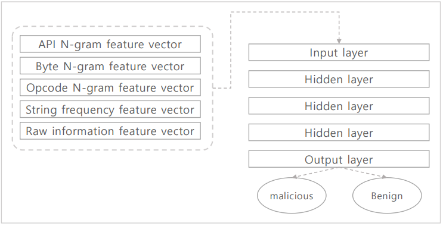
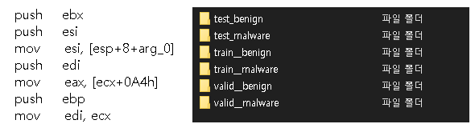
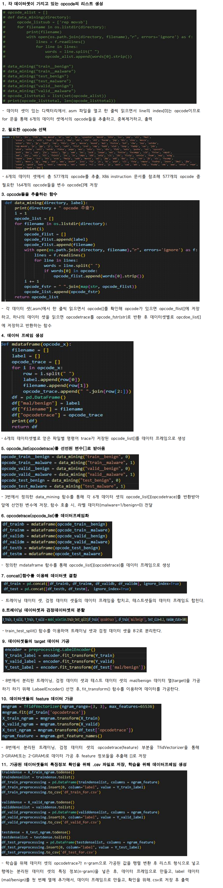
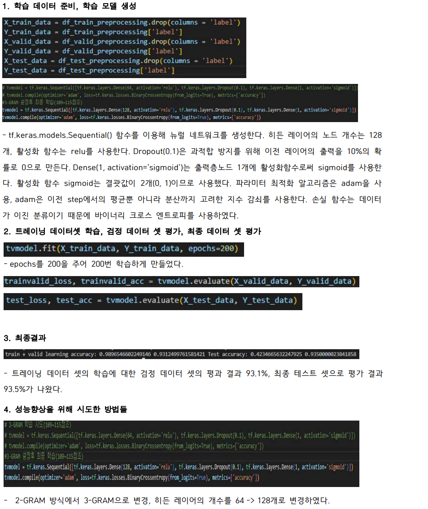

# MaliciousCodeAnalysis

<div align="center">
    
</div>

<br>

<details>
<summary><b> 📌 프로젝트 개요</b></summary>
<br>

- N-GRAM 기반 탐지를 이용해 Opcode를 토큰으로하는 Opcode N-Gram을 이용해 머신러닝 기반 악성코드 탐지를 구현
- test(정상, 악성), train(정상, 악성), valid(정상, 악성)로 이루어진 데이터의 OPcode를 추출해 N-Gram으로 가공후 특징정보 추출
- tensorflow를 이용해 모델 학습 수행

</details>

<br>

<details>
<summary><b> 🏃 프로젝트 실행</b></summary>
<br>

```bash
# prerequisites: python
# execution
git clone https://github.com/MpqM/ML_MaliciousCodeAnalysis
python malicious_code_analysis.py
```

</details>

<br>

<details>
<summary><b> 🚀 프로젝트 설명</b></summary>
<br>

- Data Set Sample
<p align ="center">
    
</p>

- 6개의 데이터셋들에서 opcodeTrace 추출, target(mal/benign)과 feature(n-gram)데이터 가공</b>
<p align ="center">
    
</p>

- 모델 학습
<p align ="center">
    
</p>

</details>

<br>

<details>
<summary><b> 🎮 프로젝트 스택</b></summary>
<br>

| **CATEGORY** | **SKILLS**                                                                                            | 
|--------------|-------------------------------------------------------------------------------------------------------|
| **LANGUAGE** |  |

</details>

<br>
